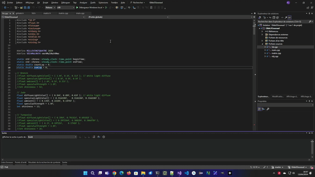

# Glide3Gouraud

3DFX Voodoo revival project !

# Howto

A C++ Visual Studio project aimed at displaying WaveFront 3D models in Gouraud shading on a 3DFX card.

Rendering rely on Glide 3 API. Compilation must be done in x86 32 bits mode.

Only tested on a Glide emulator. nGlide and dgVoodoo emulators (as well as Glide 3 API) can be found in 3DFX folder.
